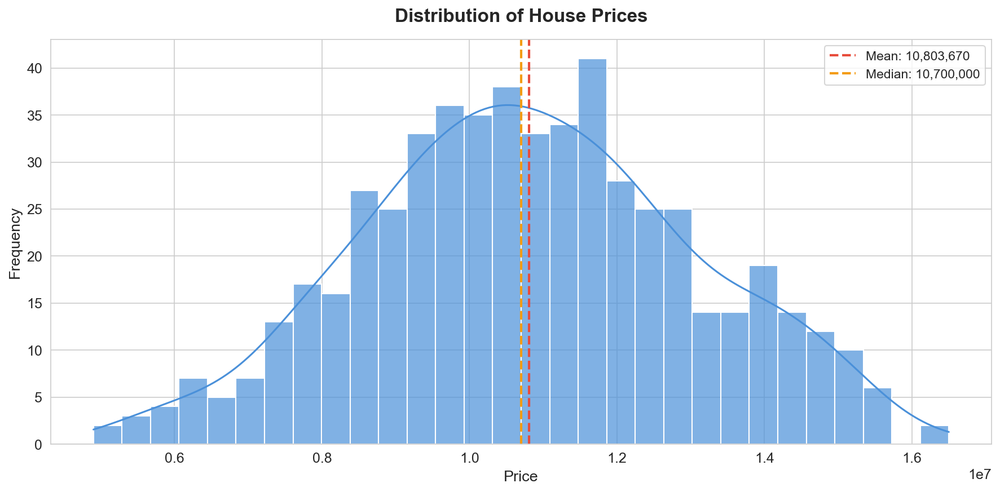
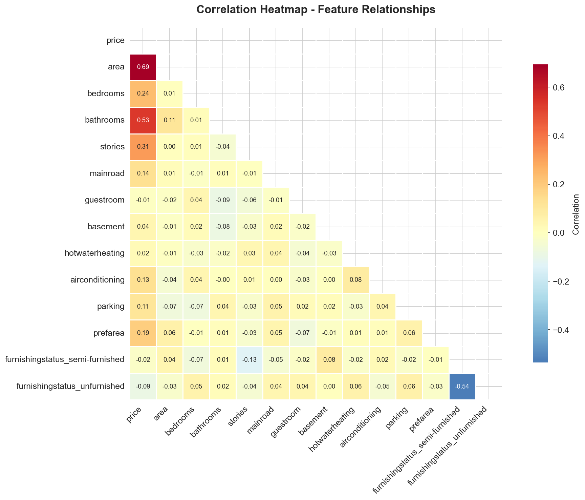
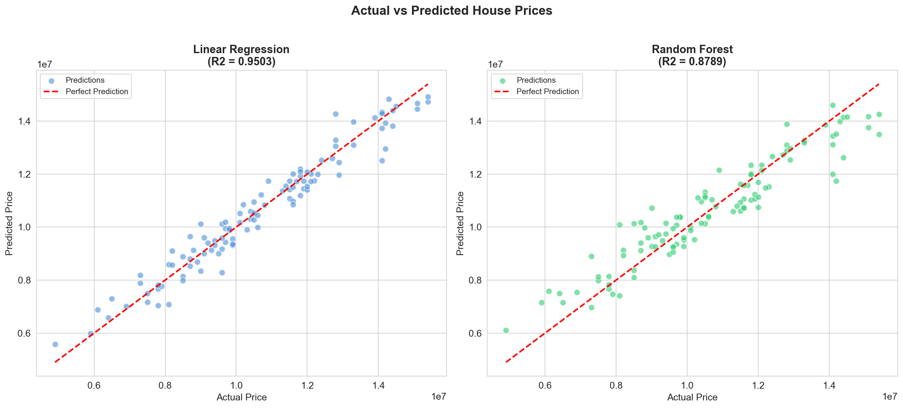

# 🏠 House Price Prediction

> **Internship Project — Week 1** | Pranay Agarwal

A machine learning project that predicts house prices based on property features using **Linear Regression** and **Random Forest Regressor**, and identifies which features most strongly influence price.

[](https://colab.research.google.com/github/Pranay-Agarwal13/housing-price-prediction/blob/main/analysis.ipynb)

---

## 📌 Problem Statement

Real estate buyers and sellers often rely on guesswork or outdated comparisons to estimate a property's fair value. This project builds a regression model that predicts house prices based on property features such as **area**, **number of rooms**, **amenities**, and **location** — and identifies which features most strongly influence price.

---

## 📦 Dataset

- **Source:** [Housing Prices Dataset — Kaggle](https://www.kaggle.com/datasets/yasserh/housing-prices-dataset)
- **Size:** 545 rows × 13 columns
- **Target Variable:** `price`

| Feature | Type | Description |
|---------|------|-------------|
| `area` | Numeric | Total area in sq. ft. |
| `bedrooms` | Numeric | Number of bedrooms |
| `bathrooms` | Numeric | Number of bathrooms |
| `stories` | Numeric | Number of stories |
| `mainroad` | Binary | Connected to main road (yes/no) |
| `guestroom` | Binary | Has guest room (yes/no) |
| `basement` | Binary | Has basement (yes/no) |
| `hotwaterheating` | Binary | Has hot water heating (yes/no) |
| `airconditioning` | Binary | Has air conditioning (yes/no) |
| `parking` | Numeric | Number of parking spots |
| `prefarea` | Binary | In preferred area (yes/no) |
| `furnishingstatus` | Categorical | Furnished / Semi-furnished / Unfurnished |

---

## ✅ Tasks Completed

| Task | Description |
|------|-------------|
| **Task 1** | Data Loading & Exploration — loaded CSV, checked shape, identified target/features, checked missing values |
| **Task 2** | Data Cleaning — handled missing values, removed duplicates, encoded categorical columns |
| **Task 3** | Model Building — trained Linear Regression & Random Forest, evaluated with MAE, RMSE, R² |
| **Task 4** | Visualization — created 3 charts (histogram, heatmap, scatter plot) |
| **Task 5** | Insights & Summary — documented key findings and business recommendations |

---

## 📊 Model Results

| Metric | Linear Regression | Random Forest |
|--------|:-----------------:|:-------------:|
| **MAE** | 402,470 | 637,092 |
| **RMSE** | 517,678 | 808,095 |
| **R² Score** | **0.9503 (95%)** | 0.8789 (88%) |

🏆 **Best Model:** Linear Regression with **95% accuracy** (R² = 0.9503)

---

## 📈 Visualizations

### Chart 1: Price Distribution


### Chart 2: Correlation Heatmap


### Chart 3: Actual vs Predicted Prices


---

## 🔍 Key Findings

- **Area** is the strongest predictor of house price (importance: 0.520)
- **Bathrooms** and **stories** are the next most influential features
- **Bedrooms** have surprisingly low importance compared to bathrooms
- Properties with **air conditioning** and in **preferred areas** fetch premium prices
- Linear Regression outperformed Random Forest on this dataset

---

## 💡 Business Recommendation

> Maximizing usable **area** and adding **bathrooms** offers the highest return on investment. Properties with **air conditioning** and in **preferred areas** also fetch premium prices. Real estate agents should highlight these features in listings.

---

## 🛠️ Tools & Libraries

| Tool | Purpose |
|------|---------|
| Python 3.x | Programming language |
| Jupyter Notebook | Development environment |
| Pandas | Data loading & cleaning |
| Scikit-learn | Regression models & evaluation |
| Matplotlib / Seaborn | Charts & visualization |

---

## 📁 Project Structure

```
housing-price-prediction/
├── analysis.ipynb          # Complete Jupyter Notebook (all 5 tasks)
├── Housing.csv             # Dataset
├── summary.pdf             # 1-page written summary
├── charts/                 # Chart images
│   ├── chart1_price_distribution.png
│   ├── chart2_correlation_heatmap.png
│   └── chart3_actual_vs_predicted.png
├── README.md
└── .gitignore
```

---

## 🚀 How to Run

1. Clone the repository:
   ```bash
   git clone https://github.com/Pranay-Agarwal13/housing-price-prediction.git
   cd housing-price-prediction
   ```

2. Install dependencies:
   ```bash
   pip install pandas numpy scikit-learn matplotlib seaborn jupyter
   ```

3. Open the notebook:
   ```bash
   jupyter notebook analysis.ipynb
   ```

4. Run all cells: **Kernel → Restart & Run All**

Or simply click the **Open in Colab** badge at the top!

---

*Made with ❤️ by Pranay Agarwal*
